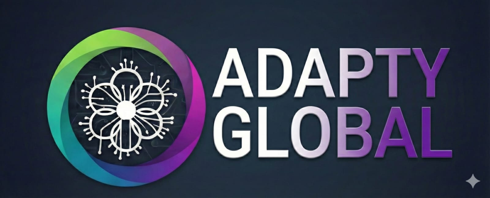

# 🏥 Adapty Global - Sistema de Análisis Biomecánico

Sistema de análisis ergonómico y biomecánico impulsado por Google Gemini AI.



## ✨ Características

- 📸 Captura de imagen con cámara o subida de archivos
- 🤖 Análisis automático con Google Gemini AI
- 📊 Puntuación ergonómica de 0 a 100
- ⚠️ Identificación de riesgos por zona corporal
- ✅ Recomendaciones personalizadas
- 🌐 Soporte multi-idioma (Español e Inglés)

---

## 🚀 GUÍA DE DESPLIEGUE EN RAILWAY (Paso a Paso)

### Paso 1: Crear cuenta en Railway

1. Ve a **[railway.app](https://railway.app)**
2. Click en **"Login"** (arriba a la derecha)
3. Selecciona **"Login with GitHub"** (recomendado) o usa tu email
4. Si usas GitHub, autoriza el acceso

### Paso 2: Crear un nuevo proyecto

1. Una vez dentro, click en **"New Project"** (botón morado)
2. Selecciona **"Deploy from GitHub repo"**
3. Si es tu primera vez:
   - Click en **"Configure GitHub App"**
   - Autoriza Railway para acceder a tus repositorios

### Paso 3: Subir el código a GitHub

Si aún no tienes el código en GitHub:

1. Ve a **[github.com](https://github.com)** y crea una cuenta (si no tienes)
2. Click en **"+"** → **"New repository"**
3. Nombre: `analisis-biomecanico` (o el que prefieras)
4. Déjalo **público** o **privado** (como prefieras)
5. Click en **"Create repository"**
6. Sube todos los archivos de esta carpeta al repositorio

### Paso 4: Conectar con Railway

1. En Railway, selecciona tu repositorio `analisis-biomecanico`
2. Railway detectará automáticamente que es un proyecto Node.js
3. Click en **"Deploy"**

### Paso 5: Configurar la API Key (MUY IMPORTANTE)

1. En Railway, click en tu proyecto desplegado
2. Ve a la pestaña **"Variables"**
3. Click en **"+ New Variable"**
4. Agrega:
   - **Variable name:** `GEMINI_API_KEY`
   - **Value:** Tu API key de Gemini (la que ya tienes)
5. Click en **"Add"**
6. El proyecto se re-desplegará automáticamente

### Paso 6: Obtener tu URL

1. Ve a la pestaña **"Settings"**
2. En **"Domains"**, click en **"Generate Domain"**
3. Railway te dará una URL como: `tu-proyecto.up.railway.app`
4. ¡Esa es tu aplicación funcionando! 🎉

---

## 🌐 Conectar un Subdominio (Opcional)

Si quieres usar `ergonomia.tudominio.com`:

### En Railway:
1. Ve a **Settings** → **Domains**
2. Click en **"+ Custom Domain"**
3. Escribe: `ergonomia.tudominio.com`
4. Railway te mostrará un registro CNAME

### En tu proveedor de dominio:
1. Ve a la configuración DNS de tu dominio
2. Agrega un registro **CNAME**:
   - **Nombre:** `ergonomia`
   - **Valor:** El que te dio Railway (algo como `xxx.up.railway.app`)
3. Espera 5-30 minutos para que se propague

---

## 📁 Estructura del Proyecto

```
adapty-biomechanical/
├── server.js           # Servidor backend
├── package.json        # Dependencias
├── .env.example        # Ejemplo de variables de entorno
├── .gitignore          # Archivos a ignorar en Git
└── public/
    ├── index.html      # Interfaz web
    ├── languages.js    # Configuración de idiomas
    └── logo.jpg        # Logo de Adapty Global
```

---

## 🔑 Obtener API Key de Gemini

1. Ve a **[aistudio.google.com/app/apikey](https://aistudio.google.com/app/apikey)**
2. Inicia sesión con tu cuenta de Google
3. Click en **"Create API Key"**
4. Copia la key generada
5. ¡Es GRATIS! (60 req/min, 1500 req/día)

---

## 💻 Ejecutar Localmente (Opcional)

Si quieres probar en tu computadora antes de subir:

```bash
# 1. Instalar dependencias
npm install

# 2. Crear archivo .env
cp .env.example .env

# 3. Editar .env y agregar tu GEMINI_API_KEY

# 4. Iniciar servidor
npm start

# 5. Abrir http://localhost:3000
```

---

## 🆘 Solución de Problemas

### "API Key not configured"
- Verifica que agregaste `GEMINI_API_KEY` en las Variables de Railway
- Asegúrate de que la key no tenga espacios extra

### "Server disconnected"
- El servidor puede tardar 1-2 minutos en iniciar la primera vez
- Revisa los logs en Railway (pestaña "Deployments")

### La cámara no funciona
- Asegúrate de usar HTTPS (Railway lo proporciona automáticamente)
- Permite el acceso a la cámara cuando el navegador lo solicite

---

## 📞 Soporte

**Adapty Global**  
Sistema de Análisis Biomecánico con IA

---

*Powered by Google Gemini AI* ⚡
